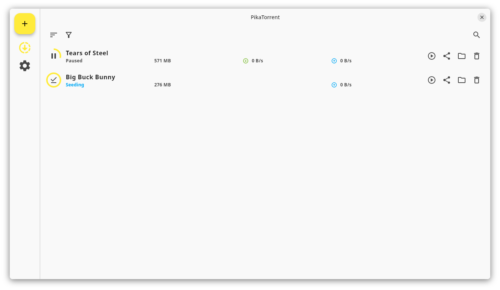
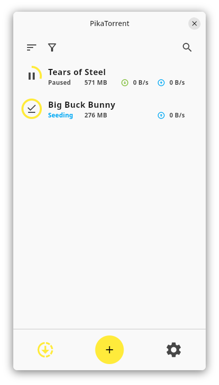
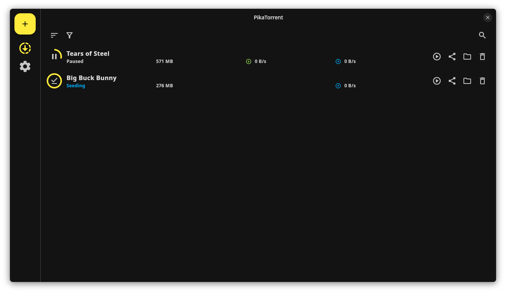
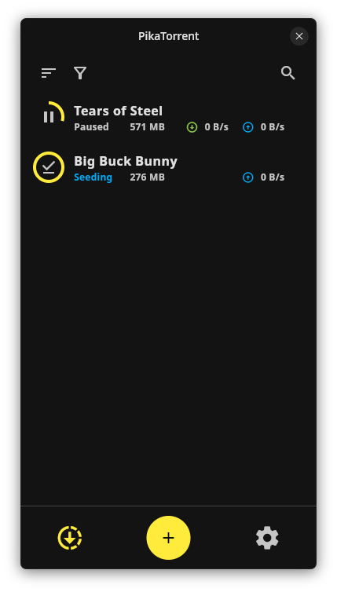

# Gravity Torrent

Just pick a Torrent. Stream and download on all your devices.

## Why a new torrent client ?

In 2025, torrent clients should not be reserved for advanced users. Gravity Torrent is a next-generation torrent client offering a beautiful, lightweight, and cross-platform app that you can install on all your devices.
Gravity Torrent also allows you to stream media, think of it like WebTorrent desktop, but also available on Android & iOS.

## Installation

To receive updates automatically and ensure the app handles links shares correctly, installation through app stores is recommended.

| Windows | Linux | MacOS | Android | iOS |
| ------- | ----- | ----- | ------- | --- |
| [Microsoft Store](https://apps.microsoft.com/detail/9n9gjq9bdjw3?mode=direct) | [Flathub](https://flathub.org/apps/com.teamantigravity.gravitytorrent) | [.dmg](https://github.com/teamantigravity/gravity-torrent/releases) | [Play Store](https://play.google.com/store/apps/details?id=com.teamantigravity.gravitytorrent) | - |
| [.zip](https://github.com/teamantigravity/gravity-torrent/releases) | [.zip*](https://github.com/teamantigravity/gravity-torrent/releases) | [.zip](https://github.com/teamantigravity/gravity-torrent/releases) | [.apk](https://github.com/teamantigravity/gravity-torrent/releases) | [.ipa (experimental)](https://github.com/teamantigravity/gravity-torrent/releases) |

**\*** .zip for linux needs `mpv` to be installed on you OS. Other dependencies might be required.

The releases are currently considered beta. Features might changes and things could break. Please use issues to report bugs or features requests.

## Screenshots

| Desktop                                                  | Mobile                                                 |
| -------------------------------------------------------- | ------------------------------------------------------ |
|  |  |
|    |    |

## Development

See [docs/development.md](./docs/development.md)

## Upgrade to >= v0.10.0

Gravity Torrent has been rewritten from scratch for v0.10.0. If you already use a previous release, upgrading to v0.10.0 will most likely not display your previous torrents.

If you want to migrate your torrents :

- Windows: Copy `%APPDATA%\\gravitytorrent\Config\transmission` to `%APPDATA%\\gravitytorrent\com.teamantigravity.gravitytorrent\Gravity Torrent`)
- Linux: Copy `~/.config/gravitytorrent/transmission` to `~/.local/share/gravitytorrent/transmission`)

After that, It's probably safe to remove these folders :

- Windows: `%APPDATA%\\gravitytorrent`
- Linux: `~/.config/gravitytorrent`

## Localization

Would you like to contribute to translations into other language(s) ?
Please visite [Weblate](https://hosted.weblate.org/projects/gravity-torrent).

## License

Proprietary
